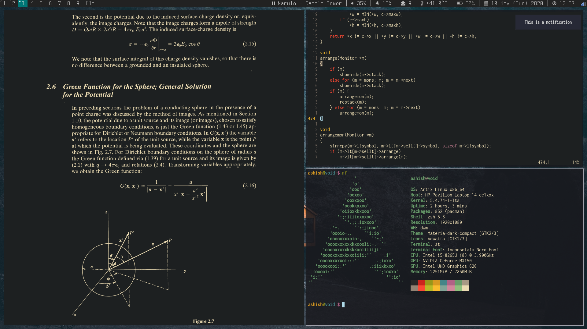

<!-- badges: start -->

<!-- badges: end -->

# Ashish's build of dwm

Ok so this is epic. I recently switched from [bspwm](https://github.com/baskerville/bspwm) to dwm and so far I'm loving it. As quoted on the [suckless](https://dwm.suckless.org) website:

> dwm is an extremely fast, small, and dynamic window manager for X window system.

This repository contains my build files of dwm which I'll be updating as and when I patch the source code to my liking. If you're new to dwm, please refer to their official [website](https://dwm.suckless.org).

## Screenshot



### Requirements

In order to build dwm, you need the Xlib header files and for the statusbar you'll need the `xsetroot` package from Xorg. If you're on an Arch-based distro install `xorg-xsetroot`.

## Installation

Fire up a terminal and type the following commands:
```sh
git clone https://github.com/paniash/dwm
cd dwm
sudo make clean install
```

## Initial setup

If you use startx to enter a graphical environment like a chad then atleast add the line `exec dwm`
in your `.xinitrc`. However if you're like me and uses a display manager (LightDM in my case) to
launch a graphical environment then add an entry for your DM (in the case of LightDM, add an entry in
the `/usr/share/xsessions` directory).

### Note

dwm doesn't have a restart option by default so after compiling the build files, you'll have to log
out and log back in which is a PITA. There are 2 patches on the website but I'd suggest to add
the following line (mentioned on the suckless website) in your `.xinitrc` which is essentially, a while loop:
```sh
#!/bin/sh

while :; do
	ssh-agent dwm || break
done
```

Please remove the `exec dwm` line if you're going to use the above script.
For keybindings, refer `config.h`.


### Patches

Currently I have the following patches installed,

* Systray - for a systray on the statusbar for applets.
* Scratchpads - multiple scratchpads bound to various keys (just like i3wm!).
* Pertag - maintain a layout per tag instead of per monitor (which is the default).
* Noborder - removes borders when a window is present in monocle mode or only one window present in view.
* Push_no_master - moves windows up/down the stack but doesn't push to master, use zoom() instead.
* Notitle - Removes the title section of windows from the statusbar (allows me to add more modules to dwmblocks).
* Focusonactive - patch that for example when opening a url in one tag shifts focus to the tag where the browser is present.
* Reset_mfact (modified resetlayout) - resets mfact on tag when only 1 client is present.
- Alwayscenter - All floating windows are centered without window rules.
- Savefloats - saves floating windows in position and size before forcing it into tiling mode.
- Focusmaster - shift focus to master from any window in the stack using a key-bind.
- Swallow - swallows windows and essentially gives my terminal, the ability to watch videos and view images (in a way).
- Fullscreen compilation - Allows fakefullscreen and fullscreen with much more practicality into it.
- Shiftviewclients - Cycle through non-empty tags.

## To-do

* ~~To add gaps (for aesthetics).~~ Gaps removed since they provide no functional improvement.
* ~~To implement moving individual windows along the stack manually.~~ Implemented in push_no_master patch.
* ~~To implement true fullscreen.~~ Done in the fullscreen compilation patch.
- ~~Implement resizing of stack windows (bspwm-like behaviour).~~ Best to come out of stack-resizing mentality persistent in manual tilers.

## Please install `libxft-bgra`!

This build of dwm does not implement color emoji in the statusbar, so you must install [libxft-bgra](https://aur.archlinux.org/packages/libxft-bgra/) from the AUR, which fixes the color emoji rendering problem, otherwise dwm will crash upon trying to render one. Note that this is only a temporary solution (hopefully) and will get fixed upstream by the suckless guys.

### Issues & Contributing

If you're facing issues with this build, feel free to open an issue in the issue tracker and I'll try my best to resolve it. Feel free to suggest changes and open PRs as well. ;)
